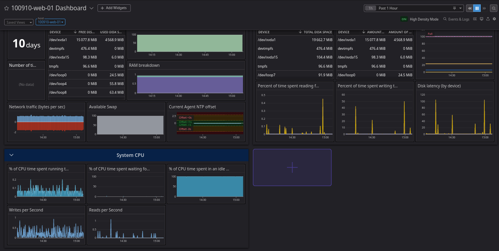

# Routine Maintenance Leads to Degraded Performance of Web and API Services

## 1. Issue summary
On **May 9, 2023, from 1:00 PM to 2:30 PM EST**, users of our web and API services experienced slow response times and errors. The issue was caused by routine maintenance on server three, which hosts the master database for our API endpoints. During the maintenance, database writes were disabled, causing a bottleneck in the system that resulted in degraded performance. Approximately **62% of users were affected**, experiencing slow response times and intermittent errors when accessing our web and API services.

## 2. Timeline
- 12:30 PM EAT: Maintenance begins on server three
- 1:12 PM EAT: Monitoring agent on server two alerts the team to slow response times and errors.
- 1:15 PM EAT: Investigation begins, starting with the web server and load balancer. Assumptions are made that the issue is related to network connectivity or load balancing.
- 1:55 PM EAT: Investigation shifts to the API endpoints and database, and the root cause is identified as disabled database writes during maintenance.
- 1:57 PM EAT: Incident is escalated to the database team.
- 2:00 PM EAT: Database writes are re-enabled and performance begins to improve.
- 2:30 PM EAT: Normal performance is restored, and incident is resolved.

## 3. Root cause analysis
The root cause of the issue was that database writes were disabled during routine maintenance on server three. The databases was misconfigured as a slave. This caused a bottleneck in the system, as the web server was unable to create new records. As a result, users experienced slow response times and intermittent errors when accessing our web and API services.

## 4. Resolution and recovery
To resolve the issue, the database team re-enabled database writes on server three by restoring its master role. Once writes were re-enabled, performance began to improve, and normal service was restored within 30 minutes. The incident was then marked as resolved, new monitoring metrics were put in place and automation implimented to ensure that database writes are not disabled during future maintenance.

## 5. Corrective and preventive measures
To prevent similar issues from occurring in the future, we will take the following corrective and preventive measures:
- Implement better communication channels between the teams responsible for server maintenance and system architecture to ensure that changes are communicated in advance and their impacts are fully understood.
- Develop a more comprehensive monitoring system to detect issues like this one earlier, with alerts and notifications that allow for a quicker response time.
- Implement a failover system for the master database to ensure that reads/writes can still be performed during maintenance, without causing a bottleneck in the system.
- Review and update our incident response plan to ensure that all teams are aware of the proper escalation procedures and communication channels in the event of an incident.
- Use automation tools to reduce the chances of onsite system misconfigurations
